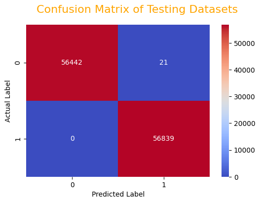
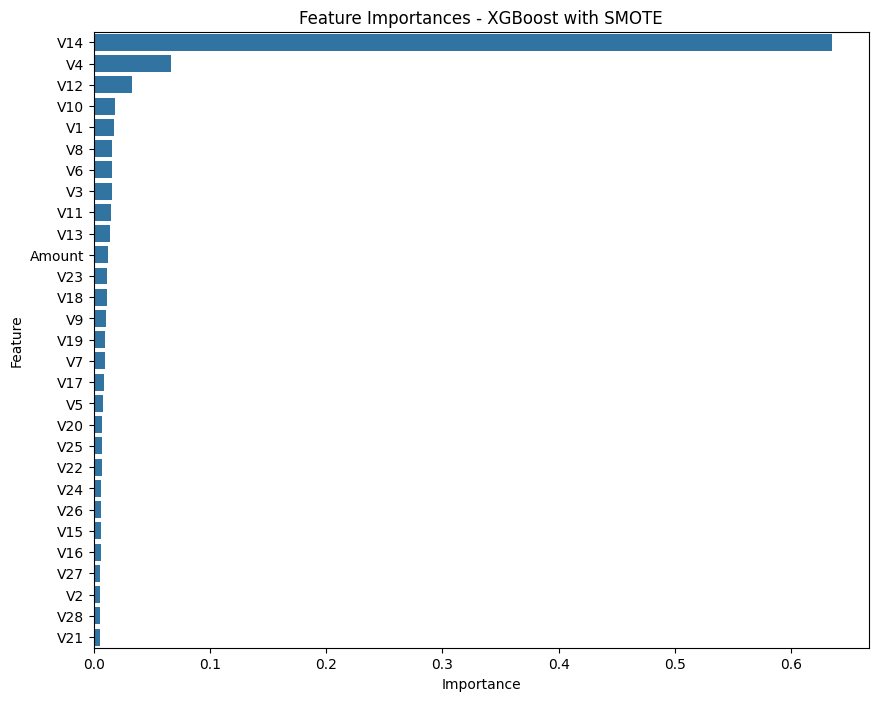

# SAFESWIPE
SafeSwipe is a credit card fraud detection system designed to safeguard against unauthorized transactions and protect cardholders from fraudulent activities. 
# Credit-Card-fraud-detection-system-using-Machine-Learning
Detect Fraudulent Credit Card transactions using different Machine Learning models and compare performances

In this notebook, I explore various Machine Learning models to detect fraudulent use of Credit cards. I compare each model performance and results. The best performance is achieved using SMOTE technique.

# Problem Statement

In this project I want to identify fraudulent transactions with Credit Cards.
My objective is to build a Fraud detection system for Zest Bank using Machine learning techniques.
In the past, such systems were rule-based. Machine learning offers powerful new ways.

ABOUT DATASETS:
URL : https://www.kaggle.com/datasets/mlg-ulb/creditcardfraud

This datasets have 492 frauds out of 284,807 transactions. It is highly unbalanced, the positive class--1 (frauds) account for 0.172% of all transactions.

It contains only numerical input variables which are the result of a PCA transformation. Due to confidentiality issues, the original features are not provided and more background information about the data. Features V1, V2, … V28 are the principal components obtained with PCA, the only features which have not been transformed with PCA are 'Time' and 'Amount'.

Feature Time contains the seconds elapsed between each transaction and the first transaction in the dataset.But, we did not consider Time for training purpose as it is of no use to build the models and may not impact our target variable.

The feature Amount is the transaction Amount, this feature can be used for example-dependant cost-sensitive learning.

Feature Class is the response variable and it takes value 1 in case of fraud and 0 otherwise.

The project uses a dataset of close to 300,000 fully anonymized transactions. Each transation is labelled either fraudulent or not fraudulent.
prevalence of fraudulent transactions is very low in the dataset. Less than 0.1% of the card transactions are fraudulent. This means that a system predicting each transaction to be normal can reach an accuracy of over 99.9% despite not detecting any fraudulent transaction. 

# STEPS

1) Business and Data Understanding

2) Importing Libraries & Loading Datasets.

3) Exploratoty Data Analysis(EDA) & Visualization.

4) Data Preprocessing & Preparing Datasets.

5) Handling Imbalanced Datasets. 

6) Modelling and evaluation on various resampled datasets.

7) Conclusion

8) Saving the best model.

9) Recommendations and next steps.

# Techniques used in the project
The project compares the results of different techniques :
- Machine learning techniques:
  - Logistic Regression
  - Gaussian NaiveBayes
  - Decision Trees
  - Xgboost classifier
  - ADA boosting

Performance of the above models is compared for different resampling approaches:
- oversampling of the minority class.
- Under-sampling of the non-fraudulent class (minority class)to match the fraudulent class
- Over-sampling of the fraudulent class to match the non-fraudulent one by implementing SMOTE technique. 

# Results

The best results are achieved by over-sampling the under-represented class using SMOTE (synthetic minority oversampling technique).
With this approach, the xgboost model is able to detect 99.999% of all fraudulent transactions in the unseen test set. This fully satisfies the primary objective to detect the vast majority of abnormal transactions. The technique and model used are simple to implement , easy to use and can be updated in real-time.

In addition, the number of false positive remains acceptable. This means a lot less verification work (on legitimate transactions) for the fraud departement compare to some other approaches which failed on this aspect. Key results are shown below:

Confusion matrix of xgboost model achieved using SMOTE over-sampling :

Visualization showing the most important features in the xgboost model using smote oversampling

